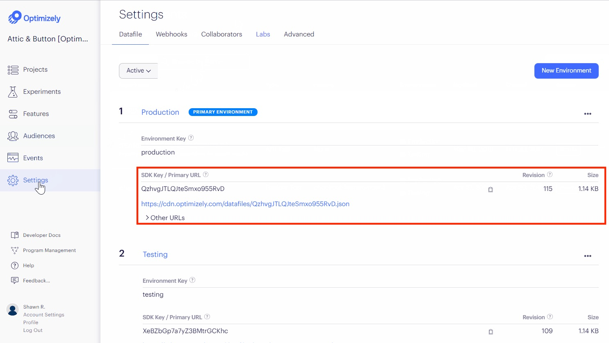

# Optimizely Android SDK Getting Started

This guide enables you to quickly get started in your development efforts to consume the Optimizely SDK on Android. This package also includes a [test-app](./test-app/README.md) module and tutorial with a functional sample application demonstrating how to build and use the SDK on Android.

For additonal information see the Full Stack [documentation](https://docs.developers.optimizely.com/full-stack/docs).

The following steps illustrate the main steps and API calls you will generally need when using the SDK.

## 1. Get the SDK Key
An SDK key is needed to use the Optimizely SDK. The SDK key is available from your Optimizely dashboard under **Settings** > **Datafile**. 



## 2. Instantiate a Client
An Optimizely client object contains all of the methods to build and run experiments. It's constructed by invoking the `Optimizely.builder` method and passing in the SDK key read from the previous step:

**Note:** Replace `SDK_KEY` with the key retrieved from the previous step.

```java
import com.optimizely.ab.android.sdk.OptimizelyManager;

OptimizelyManager.Builder builder = OptimizelyManager.builder();

OptimizelyManager optimizelyManager =  builder.withEventDispatchInterval(60L * 10L)
            .withDatafileDownloadInterval(60L * 10L)
            .withSDKKey("SDK_KEY")
            .build(getApplicationContext());
```

## 3. Query Feature Flags
The Optimizely client object's methods are then used to gather information about experiments. The following example shows client code querying the Optimizely client to obtain the enabled status of a feature and a feature variable for a given user:
```java
import com.optimizely.ab.Optimizely;

// Evaluate a feature flag and a variable
Boolean enabled = optimizelyClient.isFeatureEnabled("price_filter", userId);
Integer minPrice = optimizelyClient.getFeatureVariableInteger("price_filter", "min_price", userId);
```

## 4. Run a Feature Test
The Optimizely client's `activate` method is used to [activate](https://docs.developers.optimizely.com/full-stack/docs/activate) (start) a feature test for a given user and returns a `Variation` object that your client code can use to make decisions about what code to execute for a variation:
```java
import com.optimizely.ab.android.sdk.OptimizelyClient;
import com.optimizely.ab.config.Variation;

// Activate an A/B test
Variation variation = optimizelyClient.activate("app_redesign", userId);
if (variation != null) {
  if (variation.is("control")) {
    // Execute code for "control" variation
  } else if (variation.is("treatment")) {
    // Execute code for "treatment" variation
  }
} else {
  // Execute code for users who don't qualify for the experiment
}
```

## 5. Track an Event
The final step is to [track](https://docs.developers.optimizely.com/full-stack/docs/track) events by invoking the `track` method. The tracked events can be viewed in your Optimizely dashboard. 

The `track` method takes in an event key representing the event to track which was provided when the Optimizely app was created. It also takes in the ID of the user to track events on, and optional attributes consisting of key/value pairs to include as part of the tracked data:
```java
// Track a conversion event for the provided user with attributes
optimizelyClient.track(eventKey, userId, attributes);
```

## Releasing
The default branch is devel.  Feature branch PRs are automatically made against it. When PRs are reviewed and pass checks they should be squashed and merged into devel.  Devel will be built and tested for each commit.

Versions are managed via git tags.  Tags can be created from the command line or from the Github UI.

Snapshot builds are made off of the beta branch.  Travis will test all commits to this branch.  When a commit is tagged and pushed, Travis will build, test, *and*, ship the build to Bintray.  The version name used
is the name of the tag.  For snapshot builds the version should have `-SNAPSHOT` appended.  For example `0.1.2-SNAPSHOT`.  Multiple builds with the same version can be pushed to Bintray when using snapshot versions.
This keeps the version number from increasing too quickly for beta builds.  Grade and maven ensure that users are on the latest snapshot via timestamps.
There can be only one git tag per version name so snapshot tags may need to be moved.  For example `git tag -f -a 0.1.2` and `git push -f --tags`.  

Release builds are made off of the master branch.  Travis will test all commits to this branch.  Just like the beta branch, pushing a tag will trigger a build, tests, and release of the version of the tag to Bintray.
For example, to release version 0.1.2 you need to pull devel, checkout master, pull master, fast-forward master to devel, push master, then release 0.1.2 on Github, which creates a tag.  You could also run 
`git tag -a 0.1.2 -m 'Version 0.1.2`.  The argument to `-a` is the actual version name used on Bintray so it must be exact.  Then run `git push --tags` to trigger Travis.

*Note:* only Optimizely employees can push to master, beta, and devel branches.

## Contributing
Please see [CONTRIBUTING](CONTRIBUTING.md).

### Credits

First-party code (under android-sdk/, datafile-handler/, event-handler/, shared/, user-profile/) is copyright Optimizely, Inc. and contributors, licensed under Apache 2.0

### Additional Code
This software incorporates code from the following open source projects:

**Optimizely.ab:core-api** [https://github.com/optimizely/java-sdk](https://github.com/optimizely/java-sdk)
License (Apache 2.0): [https://github.com/optimizely/java-sdk/blob/master/LICENSE](https://github.com/optimizely/java-sdk/blob/master/LICENSE)
Additional credits from java-sdk:[https://github.com/optimizely/java-sdk/blob/master/README.md](https://github.com/optimizely/java-sdk/blob/master/README.md)

**Android Logger** [https://github.com/noveogroup/android-logger](https://github.com/noveogroup/android-logger)
License (Public Domain): [https://github.com/noveogroup/android-logger/blob/master/LICENSE.txt](https://github.com/noveogroup/android-logger/blob/master/LICENSE.txt)
